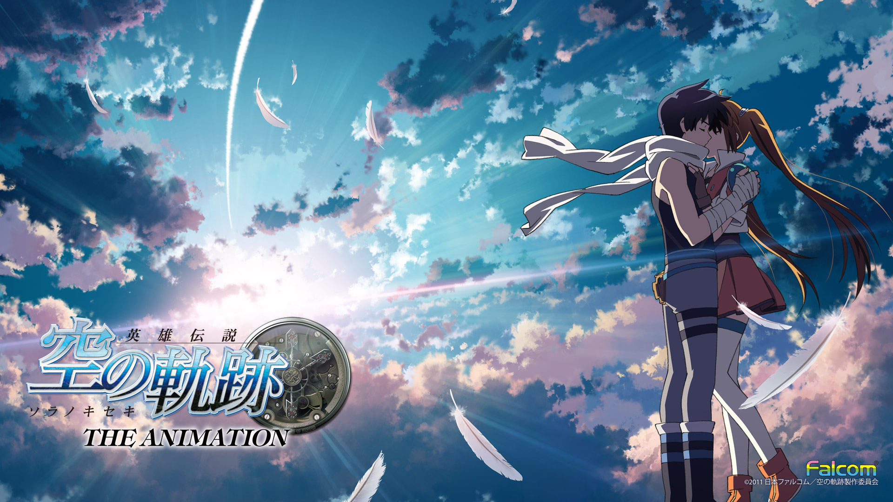

# Documentation Guide

## Introduction
My project is an unoffical commercial website for a Japan RPG game series <em>The Legend of Heroes: the Trails Series (英雄伝説シリーズ:軌跡)</em>.

<em>The Legend of Heroes</em> is a series of role-playing video games developed by Nihon Falcom. Initially issued in 2004, its "Trails Series" now includes three meta series "Trails in the Sky", "Trails from Zero" and "Trails of Cold Steel". Personally, I have been playing this series ever since 2009 and is still a big fan of its storyline and characters.

## User Profile and Comparative research
The audience I want to attract with my website would be JRPG lovers or anyone who knows the game.

 The reason why I specificlaly target these groups of people is that they are more inclined to buy and play this game and they would be more attracted to characters and story lines (which this game highlights) instead of fancy combatting scenes or gaming system.

 Although the game company has its own official website and many gaming wikis have documented the contents, in my opinion, they are not very user-friendly for players who can't speak Japanese and those who want to have a overall understanding about the story. Its official website is all written in Japanese and each game in the series has a separate website for commercial convenience.
Since all the games in this series are correlated, the idea of building a official website for it came to me. I want to integrate information in all three series and translate them into English so more people would be able to read and motivated to play and enjoy.

## Design Toolkits and Technical Reference:
The first set of websites I referred to certainly is the official websites. Since I want to present my website to potential players in English-speakign countries, I also referred to some official websites of US-popular Japanese games like Zelda.com.

  Offical reference: https://www.falcom.co.jp/sen4/system/
  Style and composition: https://www.zelda.com/

In the coding process, YouTube and W3School Turtorials helped me a lot in achieving the effects I wanted. For example:
  Turtorial Channel - Dev Ed: https://www.youtube.com/channel/UClb90NQQcskPUGDIXsQEz5Q

And a specific tutorial I would recomment would be:
https://www.youtube.com/watch?v=6C-GYwxdZd4&t=60s
This turtorial helped me create the map in my home page and was really easy to follow and understand

As my website contains many images and colors, I have also referred to some color-matching websites and have been using PhotoShop for a lot of times.

Recommend:
Palettable: https://www.palettable.io/73293E;
webGradients: https://webgradients.com/

## Process:
I have tried and learned some Html, CSS and JavaScript basics in my resume. I like how these computer languages can create neat layout and pleasant aesthetics, and I am still working on how to make some elements more interactive and interesting than a somewhat static and boring website. I think the aesthtic style and interaction I will put on my project should be compatible with what I intend to convey to my audience. By allowing my audience to interact with this website by simply scrolling, hovering and clicking, I would like them to feel the liveliness of the characters and the fun of watching and playing along the storyline.
Technically, I think I still have to work more on JavaScript and how it can be linked smoothly with my website. I would like my website to contain those elements from the websites above, and share same aesthetic with the original offcial website.

So the steps for me in upcoming weeks would be:
<li> learning more from class and turtorials about different interactive effects </li>
<li> start to prototype my website </li>

## Process
Beginning:

11.12 Map Function Initiated

The map can be highlighted and is clickable to open other pages.

11.18 Character Page and Slider Function Update

11.24 Supporting character gallery added

## Self-reflection and Future Development

Working on this project for a month, I have learned a lot about HTML/CSS/JavaScript and learned more about idea, design. While this website is still a very rough prototye, I think it inspires me a lot in how to initiate an idea and how to search for help to deal with difficulties. It also gives me some idea about how to organize a design for other purposes.

I believe I will continue working on this project in the future and complete my initial design to make this website more interactive and attractive. For example, I would like to add more information in gaming system to show how this game works and create better visual effects in terms of image-presentation.
